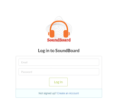

# SoundBoard

SoundBoard is a MERN stack social media application for sharing music. Users can listen to and share audio recordings.

## Screenshots

## Technologies Used

**MongoDB** - MongoDB is used to hold user and post data on the backend of the application.

**Express** - Express is the Node framework that allows for the use of middleware functions in order to send user data, auth info, and post data between MongoDB and React.

**React** - React is the frontend library that renders the whole application as a single page. The single page functionality of React allows for a smooth UI when moving from one 'page' to another, as the application is not being re-rendered every time.

**Node** - Node works in tandem with express and allows for HTTP requests to be sent through Javascript functions.

**AWS S3** - Amazon S3 is used to store image files and audio files.

## Getting Started

[CLICK HERE](https://sei-soundboard.herokuapp.com/) to get started with SoundBoard! 

This project was planned out using [Trello](https://trello.com/b/zSubvQSi/soundboard)

## Next Steps

- Setup a single-post view
- Add a comment to a post
- Sort by oldest, newest, most liked, etc.
- Login with either username or email
- Comment at a timestamp in the audio file